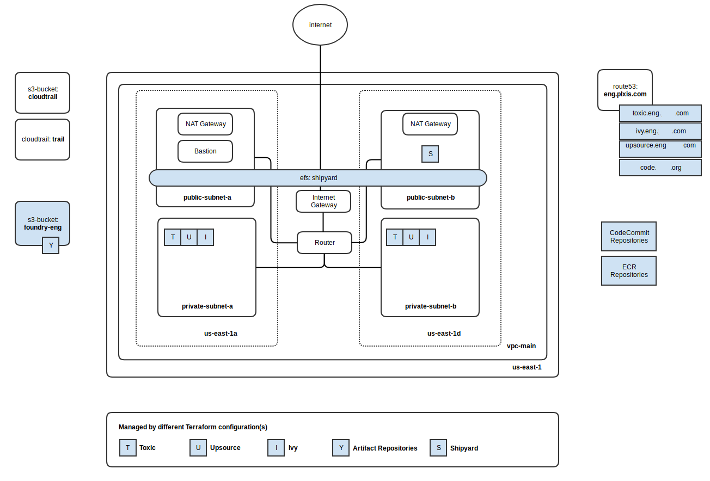

# Foundry

Foundry contains Terraform configurations for bootstrapping an AWS account with infrastructure basics to build atop of.

## Overview

This document describes the infrastructure design to support an AWS-hosted private cloud and tools for product development.

## Terraform Configuration (Foundry)

The site-wide infrastructure contains the following resources:

* VPC in a single region (default is us-east-1), with future support for multiple regions
  * Private subnet in each of 2 availability zones
  * Public subnet in each of 2 availability zones
  * NAT Gateway to allow outbound traffic from private subnets
  * Internet Gateway to route internet traffic into/out of public subnets
  * VPC endpoint to S3
  * Placeholder for bastion server or VPN gateway/connection
* CloudTrail (enabled for us-east-1)
* S3 Bucket (to capture CloudTrail logging)
* Route 53 public zone to manage subdomain domain names
* Groups
  * Admins
  * PowerUsers
  * ReadOnlyUsers
* Users, defined in a tfvars file
  * One of the above groups are assigned to each user.



## Direction and Desire

The desire is for teams to be more responsible for the entire asset stack, from infrastructure to code to deployment and configuration. Firewalls, load balancers, etc., are in the scope of what a whole team is responsible for.

So in order to fully enable this responsibility, these tools enable teams to create the infrastructure required to run the assets they are responsible for.

There will still be a separation between those that build software, and those that access Production. But there should be a closer resemblance between what is in Dev to what is in Prod. That way those with Production access will be able to execute in that environment, but a whole team will be fully aware of the infrastructure into which assets are deployed into.

Obstacles that traditionally prevent this separation:

    Infrastructure itself being in a physical data center makes it hard (team members can't just walk into a data center and rack a server)
    Lack of full skills (or training) on how to manage infrastructure
    Lack of a cohesive set of tools and processes for how to utilize the cloud environment to enable self-serve infrastructure

Foundry and Shipyard help to overcome these obstacles.

# Shipyard

Shipyard is a custom tool built to make deployments more descriptive and predictable. Built on top of semantics that are similar to Ansible and Terraform, where a desired state is described and then a set of steps are followed to ensure that state. Shipyard delegates to Ansible for software delivery, and Terraform for infrastructure delivery. There are also services that don't run on "servers" but instead utilize AWS resources (think: Lambda, or Code Commit, or ECR), and Shipyard is being evolved to also deploy these types of services. The idea is to have everything be 100% defined by code, from the servers assets runs on, to the assets themselves, to modules and services. Shipyard is agnostic. It can be utilized to automate any repetitive commands in any environment, so it can also be used in physical environments as well.

# Foundry History

AWS can be like Home Depot. Rows and rows of low level materials (services), but not "mini stores." AWS lets you set up your own little stores. 

## Our Private Cloud "in the Cloud"

At the most fundamental level, you should be able to create a simple, foundational environment ("cloud") with a minimal network and serivces configuration that can be created, managed, easily torn down, and recreated consistently. From there you can set up some initial tools that can then be used to launch all the Shipyard code that sets up infrastructure.

Foundry is the expression of this idea. Think of it as an initial "datacenter in a box" that can be expanded and can be deployed to. With Foundry, you can launch automated deployments of Shipyard scripts that create infrastructure and deploy assets and services.

## AWS accounts

Foundry can be used for different scenarios, from development to Production deployment. To this end, plan to have different AWS accounts to provide access to different environments that support specific target usage. Example:

* Lab - Every developer has access, is open, has no security restrictions, like being admins on our laptops, lets devs explore what AWS offers, one should never go from "Lab" to pre-production or production directly.
* Tmp - Supports CI (optionally via Toxic) with short-lived environments created to support integration testing. Developers cannot go in and change things directly, but instead fully delegates to Shipyard for creating any infrastructure (just like pre-production and production). Tmp is also used to stand up temporary PDTs (Partner Development & Testing environments) to support partner development.
* Engineering - A Production environment for internal assets, like Toxic, Yum repo, Docker repo, etc. Isolated from consumer-facing Production environments. Managed by small subset of team made up of senior level engineers.
* Pre-production - Long-lived, identical to production but on a smaller scale for validating deployments prior to deploying to production.
* Production - Live consumer-facing environment.

Each account that has the (F) has a Foundry instance. Each instance was built from code, is repeatable, so each Foundry instance is identical.

## Bootstrap

### Prerequisites

The target account needs to be bootstrapped prior to setting up the primary infrascturcture.

* Create AWS account
* Login in to the AWS Console as the root user
* Create _shipyard_ user with the following inline policy:
  ```json
  {
    "Version": "2012-10-17",
    "Statement": [
      {
        "Effect": "Allow",
        "Action": "*",
        "Resource": "*"
      }
    ]
  }  
  ```
* Create access keys for _shipyard_ user
* Install AWS CLI tools
  ```bash
  $ sudo pip install awscli
  ```
* Install Terraform v0.10.3 or higher
* Configure AWS credentials with _shipyard_ user access keys
  ```bash
  $ aws configure
  ```
* Create primary S3 bucket:
  ```bash
  $ aws s3api create-bucket --bucket BUCKET
  ```

* Create

### Execution

* Create a file called `backend-config.tfvars` containing the appropriate values as in the `backend-config.tfvars.sample` file
* Create a file called `foundry.tfvars` containing the appropriate values as in the `foundry.tfvars.sample` file
* To use different file names:
  ```bash 
  $ export FOUNDRY_BACKEND_CONFIG=BACKEND_CONFIG_FILE
  $ export FOUNDRY_VAR_FILE=VAR_FILE
  ```
* Run `bin/foundry`

### Finalize

Once Terraform completes, the infrastructure will be ready to support additional configurations to be deployed. The _shipyard_ user is no longer needed and should be deleted.

* Delete the _shipyard_ user
